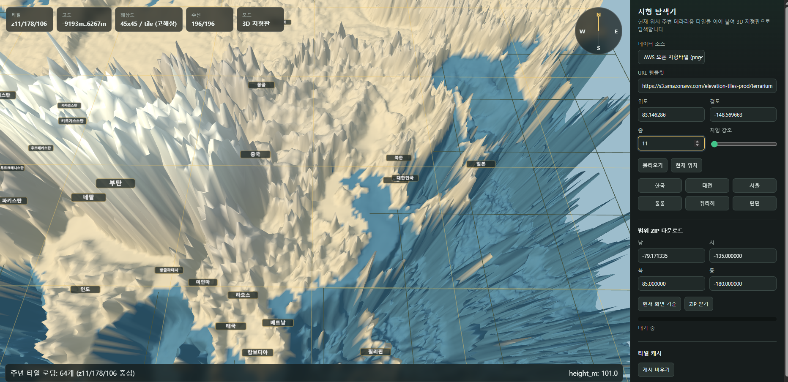

# 이상목지형탐색기

Terrarium RGB elevation tiles를 브라우저에서 받아 3D 지형으로 탐색하는 순수 프론트엔드 웹앱입니다.



## 실행

```powershell
python -m http.server 5173
```

브라우저에서 엽니다.

```text
http://localhost:5173/
```

## 주요 기능

- 현재 위치 또는 프리셋 기준 3D 지형 표시
- Mapterhorn / AWS Open Terrain Tiles / Custom URL 선택
- 현재 위치 주변 6x6 타일 자동 로딩
- 줌 레벨에 따른 지형 메시 해상도 자동 조정
- 방향키 전후좌우 이동과 주변 지형 자동 갱신
- 한글 국가/도시/산 지명 라벨 표시
- 고도값 조회, 방위표, 타일 coverage 표시
- bbox 범위 타일 ZIP 다운로드

## 데이터

- 고도 타일은 Terrarium RGB 방식으로 디코딩합니다.
- 지명 라벨은 API 키 없이 동작하도록 `country-labels.js`와 `places.js`에 내장했습니다.

## 타일 캐시 / 오프라인

- 서비스 워커(`sw.js`)가 받은 타일을 브라우저 Cache Storage(`terrain-tiles-v1`)에 저장합니다.
  새로고침·재방문 시 네트워크 없이 즉시 로드되고, 한 번 본 영역은 **오프라인**에서도 보입니다.
- bbox ZIP 다운로드를 실행하면 해당 타일들이 캐시에 함께 채워집니다(캐시 워밍).
- 패널의 **캐시 비우기** 버튼으로 비울 수 있고, 캐시된 타일 수가 표시됩니다.
- 서비스 워커는 `localhost`/HTTPS에서만 동작합니다(`file://` 불가).

## 구조 (모듈)

빌드 단계는 없습니다. three / jszip 은 `index.html` 의 importmap이 CDN에서 직접 불러옵니다.
`app.js` 는 진입점이며 기능은 `src/` 하위 모듈로 분리되어 있습니다.

| 영역 | 파일 |
| --- | --- |
| 진입점/오케스트레이터 | `app.js` |
| 상수·설정 | `src/config.js` |
| 순수 유틸 | `src/utils.js` |
| 타일 좌표 수학 | `src/tileMath.js` |
| DOM 참조 | `src/dom.js` |
| 공유 상태(S) | `src/state.js` |
| localStorage 저장/복원 | `src/storage.js` |
| 타일 fetch(LRU)/디코딩/패치 | `src/tiles.js` |
| 타일→월드 좌표 | `src/positioning.js` |
| Three.js 씬/마커/나침반 | `src/sceneSetup.js` |
| 높이그리드→3D 메시 | `src/terrainMesh.js` |
| 지명/국가 라벨(지연 생성) | `src/labels.js` |
| 로딩 오케스트레이션 | `src/terrainLoader.js` |
| 입력(마우스/방향키/휠) | `src/movement.js` |
| bbox 채우기/ZIP 다운로드 | `src/download.js` |
| 프리셋·지역 지명 | `places.js`, `country-labels.js` |

## 참고

자세한 설계와 요구사항은 `WEBAPP_REQUIREMENTS.md`와 `map/map.md`를 참고하세요.
